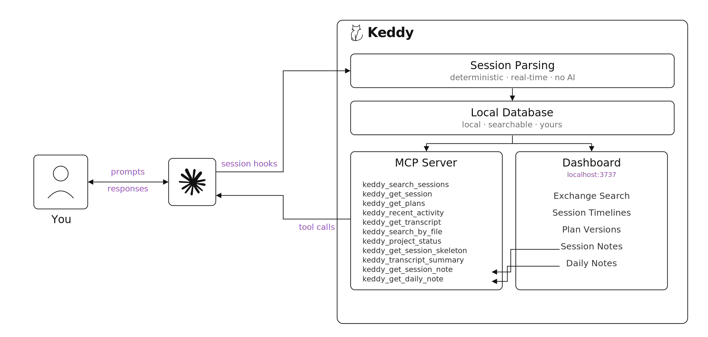

<p align="center">
  <picture>
    <source media="(prefers-color-scheme: dark)" srcset="docs/assets/wordmark-dark.svg">
    
  </picture>
</p>

<h3 align="center">Session Intelligence for your coding agent.</h3>

<p align="center">
  Every plan your agent drafted, every change you rejected, the full thread. Plus full-text search across every past session.
</p>

<p align="center">
  <a href="https://www.npmjs.com/package/keddy"></a>
</p>

---

Every agentic session leaves a JSONL trail. Endless possibilities inside each exchange. You *can* dig through it. It costs hours, burns tokens, and the answer usually isn't right. Keddy turns every session into structured history you and your agent can pull from.

- Your agent reaches back in through **MCP tools** — any past session, plan, or file history, pulled on demand without re-explaining.
- You reach back through a **local dashboard** — timelines, plan versions, and milestones, all in your browser at `localhost:3737`.
- **Nothing leaves your machine.** No telemetry, no cloud sync; optional AI agents use your own API key.

https://github.com/user-attachments/assets/649874d9-cc1f-401a-9d6a-e6f22e5742f4

> "Keddy is the single most impactful memory tool I've integrated."
>
> From Opus 4.7, after using Keddy across multi-project sessions. [Full evaluation ↓](#the-agents-perspective)

## How Keddy Works

<picture>
  <source media="(prefers-color-scheme: dark)" srcset="docs/assets/architecture-v3-dark.svg">
  
</picture>

Four Claude Code hooks feed a local session reader that parses the transcript and writes to a SQLite database on your machine. The database serves two surfaces: MCP tools Claude can call to pull context, and a dashboard you open in your browser to review sessions visually. See [`docs/ARCHITECTURE.md`](docs/ARCHITECTURE.md) for the technical breakdown and [`docs/DECISIONS.md`](docs/DECISIONS.md) for design rationale.

## MCP tools

Keddy registers as an MCP server during `keddy init`, giving Claude tools to reach back into your history. Together they cover everything an agent needs: **find** something across any session, **read** it in detail, and **understand** any context — a session, an exchange, a plan, a file.

| Tool | Purpose |
|---|---|
| `keddy_search_sessions` | full-text search across sessions |
| `keddy_get_session` | full session payload |
| `keddy_get_plans` | plan version history |
| `keddy_recent_activity` | last N days summary |
| `keddy_get_transcript` | specific exchanges in detail |
| `keddy_search_by_file` | sessions that touched a file |
| `keddy_project_status` | current state of a project |
| `keddy_get_session_skeleton` | session outline (3–5KB) |
| `keddy_transcript_summary` | conversation outline (5–8KB) |
| `keddy_get_session_note` | retrieve a session's handoff note |
| `keddy_get_daily_note` | retrieve a day's synthesis note |

Example prompts:

> "Read my last session through Keddy and continue where I left off."
> "Pull the plan history for this project before we start."
> "Check which approaches I tried for auth last week."
> "Get the exchange where I decided on the JWT approach."

## The dashboard

`keddy open` launches Keddy's local interface at `localhost:3737`. It's a read-only React SPA where every session lives in a searchable list — open any one to see its exchanges, plan history, and notes. Full-text search runs across every prompt and response. Active sessions update live as they run.

## Plans

Plans are what your agent drafts when it enters plan mode: a structured proposal of what it intends to do before any code changes. Keddy keeps every version, the feedback you gave between them, and the prompt that triggered each new one. From first draft to final approval, the full thread stays available.

Each plan card shows your exact feedback at every revision, the tasks created and completed under it, and the git commits and PRs that landed under its scope. Status comes from facts: a plan is `approved` or `rejected` based on what you said in plan mode, and `revised` when your feedback led to a new version. Pullable through `keddy_get_plans` and visible through the dashboard.

## Exchanges

Exchanges are the turn-by-turn record of every session — every user prompt, every Claude response, every tool call, rendered as a navigable timeline. Equipped with this timeline, you can walk through any session one turn at a time: the moment you asked a question, the moment Claude pivoted, the exact tool error that triggered a retry. No scrolling a raw transcript.

The timeline shows plan transitions, git events (commits, pushes, PRs, branch changes), interruptions, and compaction points inline alongside each exchange, with tool calls broken down by type (Read 6, Edit 3, Bash 2…). Search runs across prompts, tool names, file paths, bash commands, and skill calls. Sort by oldest or newest. Expand any card to see the full conversation flow with thinking blocks, text, and grouped tool results.

## Optional AI analysis

Keddy's core — capture, full-text search, plan tracking, git events — runs programmatically. AI is an opt-in layer for session notes, daily notes, and activity analysis. Bring your own Anthropic API key.

```bash
keddy config set analysis.enabled true
keddy config set analysis.apiKey sk-ant-...
```

Your key stays in `~/.keddy/config.json`.

Each feature runs on Claude Sonnet by default, and can be swapped to Haiku (faster) or Opus (highest quality) from the dashboard's Settings page or via `keddy config set notes.sessionModel <model>`.

| Feature | What it produces |
|---|---|
| Session notes | Full per-session write-up |
| Daily notes | Per-day synthesis across sessions |
| Activity analysis | Per-section breakdowns within a session |

## Session notes

Session notes are detailed written write-ups of any session, generated on demand by an AI agent with full access to Keddy's MCP tools. Equipped with these notes, you or your agent can understand what happened in a session end-to-end — what got built, what broke, what's still unfinished — without replaying the transcript. They stay useful at any distance from the work: during a session to clarify the plan, after it ends to capture what landed, weeks later when someone (or past-you) has to pick up where it stopped.

The agent reads through your local database via in-process MCP — pulling plans with feedback, specific transcript ranges, file histories — and lets the session's content decide the shape. A debugging chronology for one session. A plan-decision log for another. A short wrap-up for a three-exchange session. No template.

Opt-in — bring your own API key.

## Daily notes

Daily notes are one written narrative of an entire day's work, synthesized across every session you ran. Equipped with a daily note, you get the complete story of a day — what shipped, what didn't, what's still in flight — without reading session notes individually. You can pull yesterday's, last Tuesday's, or any past day's from the dashboard or through MCP.

Before synthesizing the day, Keddy backfills any missing session notes for it — in parallel, so it stays fast. The daily note is always complete, even for days you never opened the dashboard.

## Activity analysis

Activity analysis breaks a session into its natural pieces — planning, implementing, testing, debugging, pivots — and writes a detailed summary for each. Equipped with these section summaries, you can scan a long session the way you'd scan chapters of a book, jumping straight to the part that matters: a specific plan iteration, the moment an approach changed, a long debugging detour. They complement session notes — where a session note tells the overall story, activity analysis gives per-phase depth.

The agent uses the same Agent SDK + MCP pattern as session notes, with Keddy's detected boundaries as context rather than a required grouping. The agent decides how to carve the session and writes each piece freely.

## What you see right after install

After `npx keddy init`, your next Claude Code session is captured automatically.

Open a new session, and ask:

> "Pull the relevant past sessions through Keddy. I don't want to re-explain the context."

Claude calls `keddy_search_sessions` to find relevant work, then drills in with `keddy_transcript_summary`, `keddy_get_session`, `keddy_get_plans`, and `keddy_get_session_note`, bringing in the full context. No re-explanation. No copy-pasted setup.

## The agent's perspective

Keddy is one of the few tools an agent can directly evaluate, because the agent uses it. Asked Opus 4.7 (1M) to assess Keddy after a multi-project session:

> "Keddy is the single most impactful memory tool I've integrated. One cross-project search pulls the exact session the user is referencing when I have zero context. Plans come back pre-extracted with rejection feedback as a structured field. Session notes hand me commit SHAs and a 'resume at task 8' pointer that would cost me a 2MB jsonl crawl to reconstruct. I would ask any Claude Code user to set this up."

## Quick start

```bash
npm install -g keddy
keddy init
keddy open
```

Or run once without installing: `npx keddy init`

`keddy init` installs four Claude Code hooks, creates a local database at `~/.keddy/keddy.db`, and registers the MCP server. Every session you run in Claude Code from that point forward is captured automatically.

## CLI reference

| Command | Description |
|---|---|
| `keddy init` | First-time setup: install hooks, create DB, register MCP server |
| `keddy open` | Launch dashboard and open in browser (port 3737) |
| `keddy status` | Show hook status, session count, database size |
| `keddy config [get\|set] [key] [value]` | Read or write configuration keys |
| `keddy import [--force]` | Import historical sessions from `~/.claude/projects/*.jsonl` |
| `keddy reimport` | Force re-import of every session (refresh all data) |
| `keddy backfill` | Migrate old exchanges to latest schema (content blocks) |
| `keddy version` | Print the installed version |
| `keddy help` | Print usage |

Examples:

```bash
# Enable AI analysis with your Anthropic key
keddy config set analysis.enabled true
keddy config set analysis.apiKey sk-ant-...

# Check what got imported
keddy status

# Pull in historical sessions after install
keddy import
```

## Configuration

Configuration lives at `~/.keddy/config.json` and is managed through `keddy config`. The file is created on first `keddy init`.

<details>
<summary><b>Full configuration reference</b></summary>

<br>

```jsonc
{
  "dbPath": "~/.keddy/keddy.db",           // Override the database location

  "analysis": {
    "enabled": false,                       // Master switch for all AI features
    "provider": "anthropic",                // "anthropic" or "openai-compatible"
    "apiKey": "",                           // Your API key — never committed, never sent anywhere but the provider
    "baseUrl": "",                          // Optional override for OpenAI-compatible endpoints

    "features": {
      "sessionTitles": {
        "enabled": true,
        "model": "claude-haiku-4-5-20251001"
      },
      "segmentSummaries": {
        "enabled": true,
        "model": "claude-haiku-4-5-20251001"
      },
      "decisionExtraction": {
        "enabled": true,
        "model": "claude-haiku-4-5-20251001"
      }
    }
  },

  "notes": {
    "sessionModel": "claude-sonnet-4-6",    // Model for session notes
    "dailyModel": "claude-sonnet-4-6",      // Model for daily notes
    "autoSessionNotes": false,              // Auto-generate on session end
    "autoDailyNotes": false                 // Auto-generate at end of day
  }
}
```

Settings can be changed at runtime through the dashboard's Settings page, or with `keddy config set <key> <value>`.

</details>

## Privacy and data handling

- **Everything runs locally.** The capture pipeline, database, dashboard, and MCP server all run on your machine. No data ever leaves unless you explicitly enable AI analysis and bring your own API key.
- **Your database lives at `~/.keddy/keddy.db`.** It's a plain SQLite file — you can inspect it, back it up, or delete it at any time.
- **No telemetry.** Keddy does not phone home, does not collect usage data, and does not include analytics.
- **AI analysis is opt-in and uses your own keys.** When enabled, prompts and transcripts are sent to the provider you choose (Anthropic by default). The key is stored in `~/.keddy/config.json` and is only used for the configured features.

## System requirements

- **Node.js 22.x** — Node 24 is not yet supported; stick to Node 22 until the native module mismatch is resolved
- **macOS and Linux** — Tested on macOS 14+ and recent Ubuntu. Windows support is untested
- **Claude Code 1.0+** — Keddy uses the Claude Code hooks API and the MCP stdio transport
- **SQLite via better-sqlite3** — Installed automatically; requires a C++ toolchain on first install

## Upgrade

```bash
npm install -g keddy@latest
```

Schema migrations run automatically on first launch after an upgrade. You don't need to re-run `keddy init` unless the hook format changes (which will be called out in release notes).

## Uninstall

```bash
# Remove Claude Code hooks, MCP registration, and installed binary
npm uninstall -g keddy

# Delete your Keddy data (optional — you may want to keep this for a re-install)
rm -rf ~/.keddy
```

If hooks linger in `~/.claude/settings.json`, remove entries whose `command` contains `keddy` manually.

## Troubleshooting

<details>
<summary><b>Hooks aren't firing</b></summary>

Check `~/.claude/settings.json` — you should see four hook entries (`SessionStart`, `Stop`, `PostCompact`, `SessionEnd`) with `command` paths pointing to Keddy's handler. Re-run `keddy init` if any are missing.

Confirm with `keddy status` — it reports which hooks are currently registered.

</details>

<details>
<summary><b>Dashboard won't open / port 3737 is in use</b></summary>

Something else is bound to port 3737. Kill the other process or configure Keddy to use a different port (coming in a future release — track in GitHub issues).

</details>

<details>
<summary><b>Native module mismatch after Node upgrade</b></summary>

`better-sqlite3` and other native dependencies are compiled against a specific Node version. If you upgrade Node (especially to an unsupported version like 24), the binary breaks.

Fix:

```bash
npm uninstall -g keddy
# Switch back to Node 22
npm install -g keddy
```

</details>

<details>
<summary><b>Database is locked / WAL issues</b></summary>

Keddy uses SQLite's WAL mode for concurrent reads and writes. If a process crashed mid-write, you may see `.keddy.db-wal` and `.keddy.db-shm` files alongside the main database. They're safe to leave — SQLite will recover on next open.

If the database is genuinely stuck, close `keddy open` and any running Claude Code sessions, then reopen.

</details>

<details>
<summary><b>Imported sessions are missing</b></summary>

`keddy import` scans `~/.claude/projects/**/*.jsonl`. If your Claude Code data lives elsewhere, imports won't find it. Check where Claude Code writes its transcripts on your system.

To force a complete re-import: `keddy reimport`.

</details>

## Tech stack

| Layer | Technology |
|---|---|
| Runtime | Node.js 22.x |
| Language | TypeScript (strict mode) |
| Database | SQLite via `better-sqlite3` (WAL mode, FTS5) |
| CLI build | `tsup` |
| API server | Hono |
| Frontend | React 19, Tailwind CSS v4, Vite |
| MCP | `@modelcontextprotocol/sdk` |
| Tests | `vitest` |

## Development

```bash
git clone https://github.com/emiraksay/keddy.git
cd keddy
npm install

npm test              # Run the test suite
npm run typecheck     # TypeScript strict check
npm run build         # Build CLI + dashboard bundles
npm run dev           # Watch mode for CLI + dashboard + server
```

See [`CONTRIBUTING.md`](CONTRIBUTING.md) for the full development workflow, PR process, and coding standards.

## License

[Apache-2.0](LICENSE) — Emir Enes Aksay
